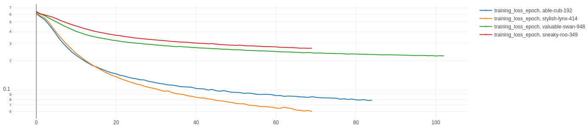
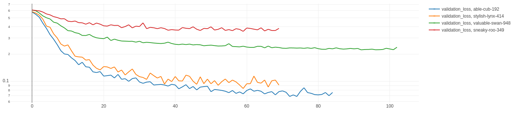

# Experiments
## Technical considerations for reproducibility
This project uses [DVC](https://dvc.org/) for data versioning and [MLflow](https://mlflow.org/) for experiment tracking.

If you want to download the data corresponding to these experiments, run:
```bash
dvc pull -aT
```

In particular, `dvc pull` should retrieve the `mlruns/` folder. You can then open MLflow like this:
```bash
mlflow ui
```

In the results, the git commit hashes and the MLflow experiment names are always given for reference.

## 2023-07-14
### Description
#### Bug in data collection
I found a bug in the definition of `CombatDeclareBlockersPhase` which resulted in a bad data collection.

Indeed, we can see at line 33 that the method to choose an action is not named correctly:

```python
action = blocker_player._choose_action(
    ...
)

# Should be 'choose_action' without the underscore
```

Because of this, all actions during this phase were not recorded.

#### A new DVC stage to measure statistics about the dataset
In order to verify my hypothesis (and to prevent this kind of issues to happen again), I added a DVC stage which computes basic statistics about the game logs dataset:

```
                            +--------------+                                
                            | collect_data |                                
                           *+--------------+*                               
                       ****                  ****                           
                   ****                          ****                       
                 **                                  **                     
+-------------------------+                +----------------------------+   
| compute_game_logs_stats |                | train_deep_learning_scorer |   
+-------------------------+                +----------------------------+   
                                                          *                 
                                                          *                 
                                                          *                 
                                          +-------------------------------+ 
                                          | evaluate_deep_learning_player | 
                                          +-------------------------------+ 
```

### Results
#### Dataset
I fixed the bug and ran `dvc repro`. A new dataset was created and we can notice thanks to the statistics that `DeclareBlockerAction` was not represented in the previous dataset:

| Dataset    | Git commit hash | Number of instances | Proportion of winning instances | Number of PlayLandAction | Number of NoneAction | Number of TapAction | Number of CastCardAction | Number of DeclareAttackerAction | Number of DeclareBlockerAction |
| ---------- | --------------- | ------------------- | ------------------------------- | ------------------------ | -------------------- | ------------------- | ------------------------ | ------------------------------- | ------------------------------ |
| Before fix | b65b4134        | 268,388             | 52.5%                           | 14,979                   | 76,298               | 141,359             | 16,079                   | 19,673                          | 0                              |
| After fix  | 7c8f43fa        | 283,113             | 52%                             | 14,979                   | 86,703               | 141,359             | 16,079                   | 19,673                          | 4,320                          |

__Note:__ the number of games is still 1,000 and the class of the two players is still `RandomPlayer`. The training and validation proportions are still 80% and 20%.

#### Summary Table
I ran experiments with similar parameters as previously but using the new dataset. Here is a comparison of the results before and after the fix.

##### Before fixing the bug
| Git commit Hash | MLflow experiment name | Player Class                 | Scorer Model Class   | Number of parameters | transformer_n_layers | transformer_n_heads | Win Rate against a random player |
| --------------- | -----------------------| ---------------------------- | -------------------- | -------------------- | -------------------- | ------------------- | -------------------------------- |
| 0a1f0c67        | able-cub-192           | SampleActionFromScoresPlayer | SingleActionScorerV2 | 141,825              | 2                    | 8                   | 51.3%                |
| b031673e        | stylish-lynx-414       | SampleActionFromScoresPlayer | SingleActionScorerV2 | 275,713              | 4                    | 8                   | 51.7%                |

__Note:__ Copied from the experiments of `2023-07-01`.

##### After fixing the bug
| Git commit Hash | MLflow experiment name | Player Class                 | Scorer Model Class   | Number of parameters | transformer_n_layers | transformer_n_heads | Win Rate against a random player |
| --------------- | -----------------------| ---------------------------- | -------------------- | -------------------- | -------------------- | ------------------- | -------------------------------- |
| 42a84d22        | valuable-swan-948      | SampleActionFromScoresPlayer | SingleActionScorerV2 | 141,825              | 2                    | 8                   | 50.9%                |
| 7c8f43fa        | sneaky-roo-349         | SampleActionFromScoresPlayer | SingleActionScorerV2 | 275,713              | 4                   | 8                   | 51.7%                            |

#### Training Loss Comparison


#### Validation Loss Comparison


### Analysis of the results
We can see that the models based on the new dataset have a higher loss than the previous ones, however the win rate is quite the same. No progress was made regarding the performance but at least now we are sure that the models get to see instances of `DeclareBlockerAction`.

#### Comparison between the new models and a random player
As we added the possibility to compute statistics about a game logs dataset, we can also do this after the evaluation against a random player.

It becomes possible to compare the actions chosen by a random player compared to our trained player:

| Git commit Hash | MLflow experiment name | Player Class                 | Scorer Model Class   | Number of instances | Number of PlayLandAction | Number of NoneAction | Number of TapAction | Number of CastCardAction | Number of DeclareAttackerAction | Number of DeclareBlockerAction |
| --------------- | ---------------------- | ---------------------------- | -------------------- | ------------------- | ------------------------ | -------------------- | ------------- | ----------- | ---------------------- | ------------------------------- |
| cfb8edec        | valuable-swan-948      | RandomPlayer                 | NA                   | 139,085             | 7,373                    | 42,782               | 69,241        | 7,927       | 9,588                  | 2,174                           |
| cfb8edec        | valuable-swan-948      | SampleActionFromScoresPlayer | SingleActionScorerV2 | 138,176             | 7,370                    | 42,626               | 68,246        | 7,911       | 10,008                 | 2,015                           |

The only noticeable difference is that the trained player seems to play `DeclareAttackerAction` a bit more often that a random player, apart from this their behaviors are similar.

#### Possible improvements
The improvements described in the section `2023-07-01` still apply.

#### Possible biases and broken rules
The biases and broken rules described in the section `2023-07-01` still apply.

## 2023-07-01
### Description
#### Objectives
The main goal of these experiments is to develop an AI player to play Magic The Gathering using Machine Learning. In order to find the best model, it is necessary to try different strategies, architectures and model configurations.

As a first baseline result, we evaluate an AI in comparison to a random player (which always chooses one action randomly among the legal actions).

#### What is the experimental design?
This project implements a DVC pipeline to make it easier to train and evaluate Machine Learning model. The pipeline looks like this (output of `dvc dag`):
```
        +--------------+           
        | collect_data |           
        +--------------+           
                *                  
                *                  
                *                  
  +----------------------------+   
  | train_deep_learning_scorer |   
  +----------------------------+   
                *                  
                *                  
                *                  
+-------------------------------+  
| evaluate_deep_learning_player |  
+-------------------------------+  
```

Here is a description of each stage:
1. **collect_data**: This stage simulates N games between two random players and save the game logs as a pickle (`data/game_logs_dataset.pickle`)
2. **train_deep_learning_scorer**: This stage applies a train/validation split on the game logs data, trains a "scorer" and saves the best checkpoint (according the the validation loss) at `results/models/deep_learning_scorer.ckpt`
3. **evaluate_deep_learning_player**: This stage simulates N games between a random player and an AI which uses the trained scorer, the win rate is saved and used as an evaluation metric

#### What is a "scorer" and how does the player AI work?
In Magic The Gathering, a player needs regularly to choose which action it wants to play. A naive strategy consists in choosing one action at random among the legal actions, this is what we call a random player.

In order to implement a more intelligent player, it is necessary to gain the ability to evaluate actions in the context of a given game state. The module which is responsible for this is called a "scorer".

A scorer receives the current game state and a set of possible actions, then it assigns a score to each possible action. The AI player can then choose which action to play based on these scores.

There are different strategies to choose actions based on scores, currently only one is implemented:
- `SampleActionFromScoresPlayer`: it interprets the scores as a probability distribution and samples the action to choose accordingly to the score distribution

There are also different architectures of scorer:
- `SingleActionScorerV1`: a quite complex architecture which relies on MLP and Transformer Encoders to process the current game state and one action at a time
- `SingleActionScorerV2`: a simpler architecture that is composed of 2 Transformer Encoders, one for the game state and one for the action to evaluate, and a classification MLP

#### What is the training objective?
In order to train a scorer, we need to define an objective. Here is how we do it currently.

The game logs dataset records all the tuples (game_state, chosen_action) from the point of view of each player. That means that for each game we can identify the tuples which correspond to Player 0's decisions and similarly for Player 1. At the end of each game, the winner's player index is recorded.

We define a label like this:
- 0 for all tuples (game_state, chosen_action) which belong to the loser
- 1 for all tuples (game_state, chosen_action) which belong to the winner

This label is what the scorers tries to predict.

We make the assumption that if we are given enough data, this label could be a good proxy to differentiate "good actions" from "bad actions". For instance, it is expected that declaring attackers would be evaluated as rather "good" since winners need to do this in order to decrease their opponent life points.

### Results
#### Dataset
Here are some information regarding the game logs dataset which is created in the first state of the pipeline:

| Git commit Hash | Number of games for data collection | Number of games for evaluation | Player Class 0 | Player Class 1 | Total number of instances | Training Proportion | Validation Proportion |
| ----------------| ----------------------------------- | ------------------------------ | -------------- | -------------- | ------------------------- | ------------------- | --------------------- |
| b65b4134        | 1,000                               | 1,000                          | RandomPlayer   | RandomPlayer   | 268,388                   | 80%                 | 20%                   |

#### Summary Table
Several experiments were run using the same dataset as input:

| Git commit Hash | MLflow experiment name | Player Class                 | Scorer Model Class   | Number of parameters | transformer_n_layers | transformer_n_heads | Win Rate against a random player |
| --------------- | -----------------------| ---------------------------- | -------------------- | -------------------- | -------------------- | ------------------- | -------------------------------- |
| 5aa07cac        | invincible-loon-124    | SampleActionFromScoresPlayer | SingleActionScorerV1 | ~29,000              | NA                   | NA                  | 51.5%                            |
| 4928af16        | stately-roo-854        | SampleActionFromScoresPlayer | SingleActionScorerV2 | 141,825              | 2                    | 4                   | 50.1%                |
| 0a1f0c67        | able-cub-192           | SampleActionFromScoresPlayer | SingleActionScorerV2 | 141,825              | 2                    | 8                   | 51.3%                |
| b031673e        | stylish-lynx-414       | SampleActionFromScoresPlayer | SingleActionScorerV2 | 275,713              | 4                    | 8                   | 51.7%                |

#### Training Loss Comparison


#### Validation Loss Comparison


### Analysis of the results
For now, our results show that it is challenging to create an AI that plays significantly better than a random player. However we can note several things:
- `SingleActionScorerV2` provides a good basis for future experiments as it looks more stable than `SingleActionScorerV1`
- The win rate evolves accordingly to the complexity of the scorer, although the effect is small. At least, it becomes easier to predict how well an AI will perform based on its scorer configuration

#### Possible improvements
The current scorers don't take into consideration the past and the future. They only consider the current game state.

It would be quite easy to extend the architecture of `SingleActionScorerV2` in order to receive the action history as input. That way, the scorer would have more context to choose the next action based on the past.

Some features could be added as well. For instance, currently the scorer doesn't "know" what is the current phase in the game.

We could also change the way actions are sampled by the player, for instance always choosing the action with the highest score.

Finally, a new player class could be developed to implement a form of "Monte Carlo Tree Seach" in order to take into account the possible consequences of each action. This would require some additionnal development as the player should be able to simulate games starting from its current situation.

#### Possible biases and broken rules
The project is still not mature and some rules of Magic The Gathering are still to be developed:
- The players' hand size is not limited as it should be, that means that players can have a lot of cards in their hand (tracked by issue https://github.com/gcoter/magic-the-gathering-python/issues/46)
- The scorer receives the full game state as input (apart from the libraries), it means that in particular the current player can "see" its opponent's hand which is not permitted by the rules of Magic The Gathering (tracked by issue https://github.com/gcoter/magic-the-gathering-python/issues/49)
